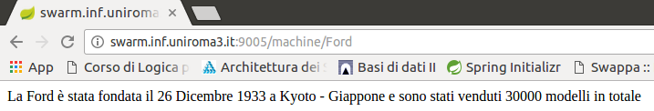

# Progetto ASW

L'applicazione è stata sviluppata da:

* Stefano Baruffa
* Marco Pavia

Questo repository contiene il codice dei servizi (Eureka, Zuul, il servizio principale S e i servizi secondari S1 e S2), gli script per la pulizia e l'avvio di questi ultimi.

## Dominio Applicativo

Il servizio principale S fornisce informazioni (casuali) sulle case automobilistiche e si avvale di due operazioni:

* `/S/<casa-automobilistica>/<paese>` restituisce informazioni (casuali) sulla `<casa-automobilistica>` (anno e luogo di fondazione) e sul numero (casuale) delle vendite nel `<paese>` indicato. 
* `/S/<casa-automobilistica>` restituisce invece informazioni (sempre casuali) sulla `<casa-automobilistica>` (anno e luogo di fondazione) e sul numero (sempre casuale) di modelli venduti nel totale.

Ad esempio,

* la richiesta `/S/Chevrolet/Italia` potrebbe restituire _La Chevrolet è stata fondata il 3 Novembre 1911 a Detroit - Michigan e sono stati venduti 180000 modelli in Italia_.
* la richiesta `/S/Chevrolet` potrebbe restituire _La Chevrolet è stata fondata il 3 Novembre 1911 a Detroit - Michigan e sono stati venduti 1800000 modelli in totale_.

Il servizio S va implementato come client di due servizi secondari S1 e S2, con le caratteristiche descritte nel seguito.

### Servizio S1

Il servizio S1 fornisce un’operazione:

* `S1/<casa-automobilistica>` restituisce anno e luogo di fondazione (casuale) della <casa-automobilistica> indicata.

Ad esempio,

*  la richiesta `/S1/Chevrolet` potrebbe restituire _3 Novembre 1911 a Detroit - Michigan_.

### Servizio S2

Il servizio S2 fornisce le seguenti operazioni:

* `S2/<casa-automobilistica>/<paese>` restituisce il numero (casuale) delle vendite della `<casa-automobilistica>` nel `<paese>` indicato.
* `S2/<casa-automobilistica>` restituisce invece il numero (casuale) totale di tutte le vendite della `<casa-automobilistica>`.

Ad esempio,

* la richiesta `/S2/Chevrolet/Italia` potrebbe restituire 180000.
* la richiesta `/S2/Chevrolet` potrebbe restituire 1800000.

Il servizio S deve rispondere al suo client usufruendo dei servizi S1 e S2 e integrando le loro risposte.

## Verifica del sistema

## Esecuzione

L'applicazione è accessibile mediante gli URL: 
* http://swarm.inf.uniroma3.it:9005

